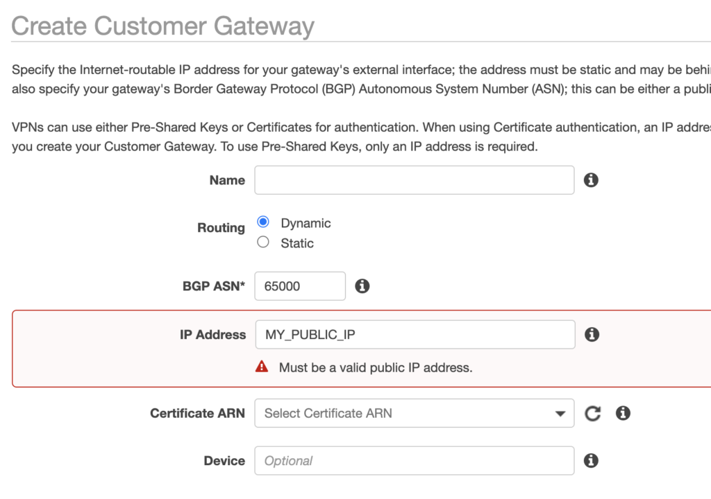
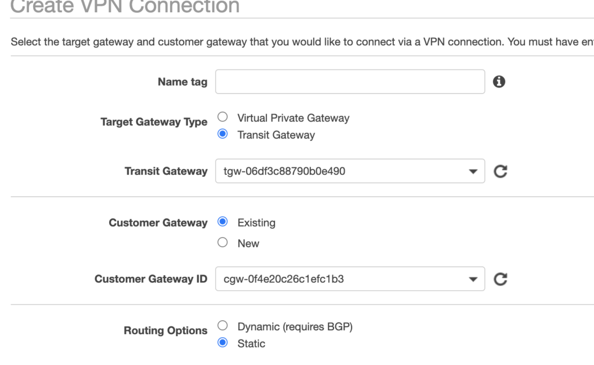
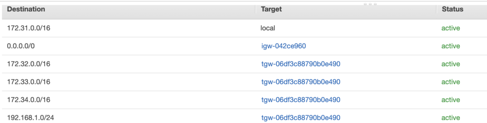
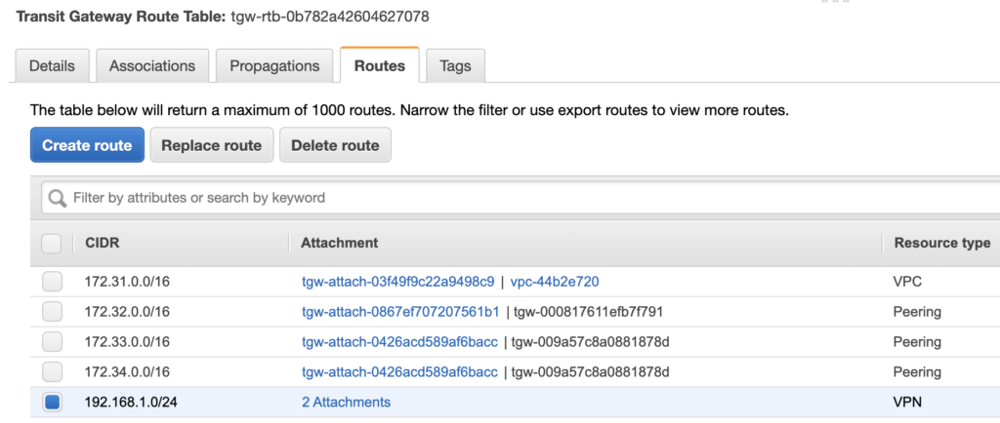
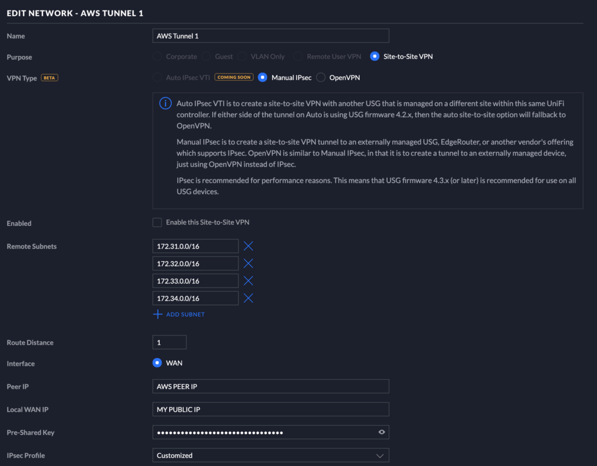

Transit Gateway (TGW) is a managed cloud router service provided by AWS and it supports direct VPN attachment.

The setup is little bit tricky as UDM doesn't support BGP.

1\. Create a Customer Gateway  
Select Dynamic routing and enter your router public IP

2\. Create VPN Profile  
Select your local transit gateway & customer gateway just created.  
Routing options need to be static for this one.

3\. Add UDM IP ranges into VPC routing table  
Set the target as local transit gateway

4\. Also add UDM IP ranges into transit gateway routing table  
attachments are two VPN endpoints created above

5\. Add VPN profile in UDM  
**Ensure 'Dynamic Routing' is enabled in advance option**  
It seems like remote subnets defined here is for routing table so if you try to make 2nd tunnel with the same remote subnets then it will reject it.

6\. Test  
Your VPN profile will now show up as "UP" and traffic should be routable for both directions. Check your security group if it doesn't work.  
In Network Manager, your VPN status will show up as impaired as 2nd tunnel is not set.
